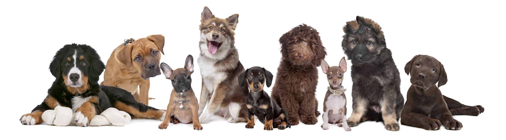

# Dog Breed Classifier

## Overview
This is a capstone project for Udacity nanodegree on Deep Learning. In this project, I built a dog identification app which can take any image as input. If there is a dog detected in the image, the model will provide an estimate of the dog's breed. If a human is detected instead, the model will output the dog breed that is most resembling. Some example outputs are:

## Data Description and Exploratory Data Analysis
The dog datasets and human datasets can be found in the dogimage folder and lfw folder in this repository. The dog dataset has already been splitted into train/val/test datasets. The dog dataset contains around 8351 total images and the human images dataset contains around 13000 images in total. There were 133 breeds in total in dog dataset.

## Model
The model was built as following steps:
* **Step 1**: Detect Human faces using OpenCV
* **Step 2**: Detect Dogs using VGG16
* **Step 3**: Create a CNN to Classify Dog Breeds (from scratch)
* **Step 4**: Create a CNN to Classify Dog Breeds (using transfer learning)
* **Step 5**: Test the model on sample image

The details for each step can be found in this jupyter notebook:
[**Jupyter notebook**](http://htmlpreview.github.io/?https://github.com/cl3080/Dog_Breed_Classifier/blob/master/report.html)

## Summary
The final model used for transfer learning in this project is ResNet-50. VGG16 and AlexNet were also tested. The performance of different models are summarized as below. ResNet-50 can produce the highest accuracy in test dataset.
* VGG16: 71%, 57 mins
* ResNet-50: 82%, 37 mins
* AlexNet: 53%, 35mins
